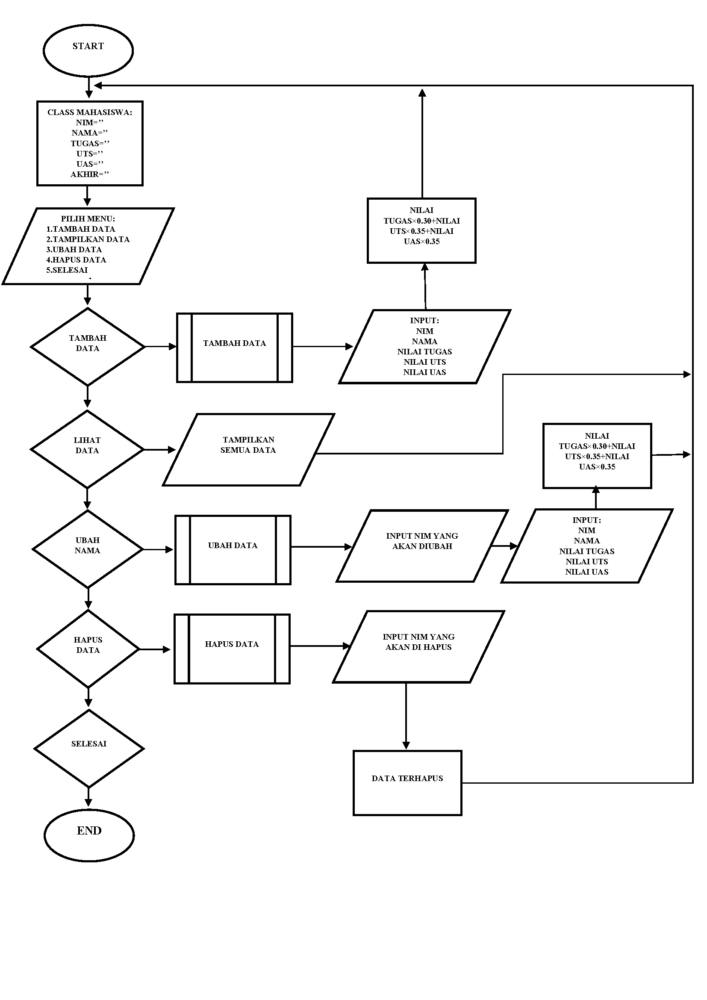
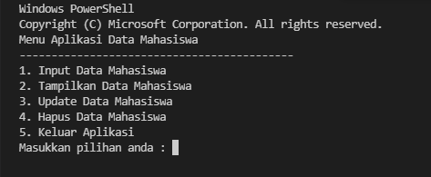
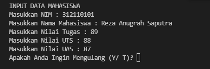
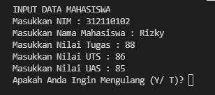
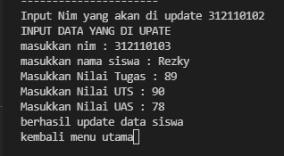
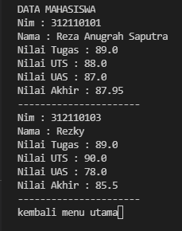
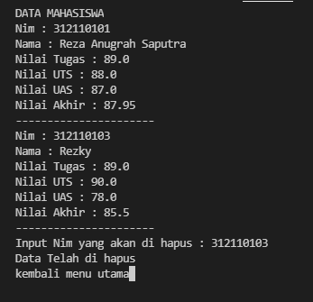
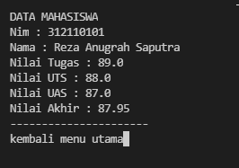
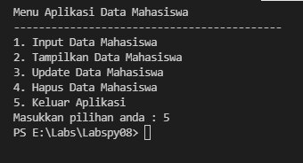

# Labspy08
Labspy08 ini berisikan file praktikum 8 pada pertemuan 12


## Pada repository Labspy08 ini, saya akan mencoba menjelaskan hasil praktikum saya mengenai penggunaan class dan atribut nya didalam python, berikut dengan flowchartnya.

- Dibawah adalah flowchart program nya



- Dibawah ini adalah code untuk meng-import, karena kita akan gunakan system, untuk mendapatkan clear screen yang ada dalam system os, jika kita perhatikan, disetiap function yang kita buat, terdapat syntax ```system('cls')```, syntax tersebut lah yang kita gunakan dalam hal import system ini. maka kita import terlebih dahulu, berikut code nya:

```python
from os import system
```

- Dibawah ini adalah untuk membuat Class, yang berfungsi untuk menampung data mahasiswa beserta atributnya. Dibawah ini saya menggunakan 6 atribut, yaitu nim, nama, tugas, uts, uas, akhir atau nilai akhir

```python
class Mahasiswa:
	nim=''
	nama=''
	tugas=''
	uts=''
	uas=''
	akhir=''
```

- Sedangkan dibawah adalah variable untuk menampung list data dari object mahasiswa, dan juga untuk menampung nilai saat user atau pengguna memilih menu

```python
pilih = 0
dataSiswa = []
```

- Dibawah adalah untuk method menampilkan daftar menu, dan juga terdapat fungsi if, ketika user memilih menu apa saja yang ada, maka program dapat langsung mengeksekusi nya

```python
def menu():
	system('cls')
	print("Menu Aplikasi Data Mahasiswa");
	print("-------------------------------------------")
	print("1. Input Data Mahasiswa")
	print("2. Tampilkan Data Mahasiswa")
	print("3. Update Data Mahasiswa")
	print("4. Hapus Data Mahasiswa")
	print("5. Keluar Aplikasi")
	pilih = int(input("Masukkan pilihan anda : "))
	if pilih == 1 :
		pilih1()
		menu()
	elif pilih == 2:
		tampil()
		input("kembali menu utama")
		menu()
	elif pilih == 3:
		index_update=-1
		tampil()
		id_edit = int(input("Input Nim yang akan di update ")) 
		for a in range(0, len(dataSiswa)): 
			if id_edit == dataSiswa[a].nim: 
					index_update = a 
					break 
		if(index_update > -1): 
			print("INPUT DATA YANG DI UPATE ") 
			siswa = Mahasiswa() 
			siswa.nim = (int(input("masukkan nim : "))) 
			siswa.nama = (input("masukkan nama siswa : "))
			siswa.tugas = (float(input("Masukkan Nilai Tugas : ")))
			siswa.uts = (float(input("Masukkan Nilai UTS : ")))
			siswa.uas = (float(input("Masukkan Nilai UAS : ")))
			siswa.akhir= siswa.tugas * 0.30 + siswa.uts * 0.35 + siswa.uas * 0.35
			dataSiswa[index_update] = siswa 
			print("berhasil update data siswa") 
		else : print("nim tidak ditemukan") 
		input("kembali menu utama") 
		menu()
	elif pilih ==4:
		system('cls') 
		tampil()
		index_delete=-1
		id_hapus = int(input("Input Nim yang akan di hapus : ")) 
		for a in range(0, len(dataSiswa)): 
			if id_hapus == dataSiswa[a].nim:
					index_delete = a
					break
		if(index_delete > -1):
			del dataSiswa[index_delete]
			print("Data Telah di hapus") 
		else : print("nim tidak ditemukan")
		input("kembali menu utama") 
		menu()
		menu()
	elif pilih == 5 :
		exit()
```

- Dibawah adalah code untuk method atau fungsi tambah data

```python
def pilih1():
	ulang = 'Y'
	while ulang in('y', 'Y'):
		system('cls')
		siswaBaru = Mahasiswa() 
		print("INPUT DATA MAHASISWA ") 
		siswaBaru.nim = (int(input("Masukkan NIM : "))) 
		siswaBaru.nama = (input("Masukkan Nama Mahasiswa : "))
		siswaBaru.tugas = (float(input("Masukkan Nilai Tugas : ")))
		siswaBaru.uts = (float(input("Masukkan Nilai UTS : "))) 
		siswaBaru.uas = (float(input("Masukkan Nilai UAS : ")))
		siswaBaru.akhir = siswaBaru.tugas * 0.30 + siswaBaru.uts * 0.35 + siswaBaru.uas * 0.35
		dataSiswa.append(siswaBaru)
		ulang = input("Apakah Anda Ingin Mengulang (Y/ T)? ")

menu()
```

- Sedangkan di bawah, adalah code untuk menampilkan data yang telah di input

``` python
def tampil():
	system('cls');
	print("DATA MAHASISWA")
	for data in dataSiswa:
		print("Nim : "+str(data.nim)) 
		print("Nama : "+data.nama)
		print("Nilai Tugas : "+str(data.tugas))
		print("Nilai UTS : "+str(data.uts))
		print("Nilai UAS : "+str(data.uas))
		print("Nilai Akhir : "+str(data.akhir))
		print("----------------------")
```

- Dibawah adalah code untuk fungsi atau method update data

```python
index_update=-1
		tampil()
		id_edit = int(input("Input Nim yang akan di update ")) 
		for a in range(0, len(dataSiswa)): 
			if id_edit == dataSiswa[a].nim: 
					index_update = a 
					break 
		if(index_update > -1): 
			print("INPUT DATA YANG DI UPATE ") 
			siswa = Mahasiswa() 
			siswa.nim = (int(input("masukkan nim : "))) 
			siswa.nama = (input("masukkan nama siswa : "))
			siswa.tugas = (float(input("Masukkan Nilai Tugas : ")))
			siswa.uts = (float(input("Masukkan Nilai UTS : ")))
			siswa.uas = (float(input("Masukkan Nilai UAS : ")))
			siswa.akhir= siswa.tugas * 0.30 + siswa.uts * 0.35 + siswa.uas * 0.35
			dataSiswa[index_update] = siswa 
			print("berhasil update data siswa") 
		else : print("nim tidak ditemukan") 
		input("kembali menu utama") 
		menu()
```

- Dibawah adalah untuk fungsi atau method delete/hapus data nya

```python
elif pilih ==4:
		system('cls') 
		tampil()
		index_delete=-1
		id_hapus = int(input("Input Nim yang akan di hapus : ")) 
		for a in range(0, len(dataSiswa)): 
			if id_hapus == dataSiswa[a].nim:
					index_delete = a
					break
		if(index_delete > -1):
			del dataSiswa[index_delete]
			print("Data Telah di hapus") 
		else : print("nim tidak ditemukan")
		input("kembali menu utama") 
		menu()
		menu()
```

- Dan code dibawah adalah fungsi untuk selesai dari program

```python
elif pilih == 5 :
		exit()
```

- Dibawah adalah code lengkap nya

```python
from os import system

class Mahasiswa:
	nim=''
	nama=''
	tugas=''
	uts=''
	uas=''
	akhir=''

pilih = 0
dataSiswa = []

def menu():
	system('cls')
	print("Menu Aplikasi Data Mahasiswa");
	print("-------------------------------------------")
	print("1. Input Data Mahasiswa")
	print("2. Tampilkan Data Mahasiswa")
	print("3. Update Data Mahasiswa")
	print("4. Hapus Data Mahasiswa")
	print("5. Keluar Aplikasi")
	pilih = int(input("Masukkan pilihan anda : "))
	if pilih == 1 :
		pilih1()
		menu()
	elif pilih == 2:
		tampil()
		input("kembali menu utama")
		menu()
	elif pilih == 3:
		index_update=-1
		tampil()
		id_edit = int(input("Input Nim yang akan di update ")) 
		for a in range(0, len(dataSiswa)): 
			if id_edit == dataSiswa[a].nim: 
					index_update = a 
					break 
		if(index_update > -1): 
			print("INPUT DATA YANG DI UPATE ") 
			siswa = Mahasiswa() 
			siswa.nim = (int(input("masukkan nim : "))) 
			siswa.nama = (input("masukkan nama siswa : "))
			siswa.tugas = (float(input("Masukkan Nilai Tugas : ")))
			siswa.uts = (float(input("Masukkan Nilai UTS : ")))
			siswa.uas = (float(input("Masukkan Nilai UAS : ")))
			siswa.akhir= siswa.tugas * 0.30 + siswa.uts * 0.35 + siswa.uas * 0.35
			dataSiswa[index_update] = siswa 
			print("berhasil update data siswa") 
		else : print("nim tidak ditemukan") 
		input("kembali menu utama") 
		menu()
	elif pilih ==4:
		system('cls') 
		tampil()
		index_delete=-1
		id_hapus = int(input("Input Nim yang akan di hapus : ")) 
		for a in range(0, len(dataSiswa)): 
			if id_hapus == dataSiswa[a].nim:
					index_delete = a
					break
		if(index_delete > -1):
			del dataSiswa[index_delete]
			print("Data Telah di hapus") 
		else : print("nim tidak ditemukan")
		input("kembali menu utama") 
		menu()
		menu()
	elif pilih == 5 :
		exit()

def tampil():
	system('cls');
	print("DATA MAHASISWA")
	for data in dataSiswa:
		print("Nim : "+str(data.nim)) 
		print("Nama : "+data.nama)
		print("Nilai Tugas : "+str(data.tugas))
		print("Nilai UTS : "+str(data.uts))
		print("Nilai UAS : "+str(data.uas))
		print("Nilai Akhir : "+str(data.akhir))
		print("----------------------")
		

def pilih1():
	ulang = 'Y'
	while ulang in('y', 'Y'):
		system('cls')
		siswaBaru = Mahasiswa() 
		print("INPUT DATA MAHASISWA ") 
		siswaBaru.nim = (int(input("Masukkan NIM : "))) 
		siswaBaru.nama = (input("Masukkan Nama Mahasiswa : "))
		siswaBaru.tugas = (float(input("Masukkan Nilai Tugas : ")))
		siswaBaru.uts = (float(input("Masukkan Nilai UTS : "))) 
		siswaBaru.uas = (float(input("Masukkan Nilai UAS : ")))
		siswaBaru.akhir = siswaBaru.tugas * 0.30 + siswaBaru.uts * 0.35 + siswaBaru.uas * 0.35
		dataSiswa.append(siswaBaru)
		ulang = input("Apakah Anda Ingin Mengulang (Y/ T)? ")		

menu()
```

## Dibawah adalah snapshot ketika program di jalankan

- Ketika program dijalankan, maka akan muncul menu seperti di bawah ini


- Ketika program di jalankan, memilih menu nomor 1



- Ketika setelah selesai input data, dan memilih y untuk tambah data, tetapi ketika memilih t untuk tidak menambah data, maka akan kembali ke menu utama



- Ketika program dijalankan, dan memilih nomor 2 untuk menampilkan data


- Setelah data ditampilkan, jika kita menekan enter, maka akan kembali ke menu utama, di bawah adalah ketika memilih untuk mengupdate data, dengan konfirmasi untuk menginput nomor nim yang ingin di ubah, dan kemudian menginput kembali data yang sesuai



- berikut ketika menampilkan data, setelah data di ubah/update



- Dan setelah data di tampilkan, jika kita enter kembali, maka akan menampilkan menu utama, dan di bawah adalah ketika kita memilik menu hapus pada program, ketika program di jalankan, maka akan ada konfirmasi untuk menginput nomor nim yang ingin di hapus, setelah nomor nim di hapus dan sesuai dengan yang ada di data, maka data akan terhapus. Tetapi jika nomor nim yang kita inputkan salah, maka akan muncul konfirmasi "nim tidak ada"



- Dan setelah selesai menghapus data, jika kita tekan enter, maka akan kembali ke menu utama, setelah itu kita pilih menu nomor 2 untuk menampilkan data, maka akan di tampilkan data yang telah terupdate, karena ada nya penghapusan data



- Setelah memastikan bahwa data telah terhapus, jika kita enter maka akan kembali ke menu utama, dan jika kita pilih menu nomor 5, untuk selesai dari program, maka hasilnya akan seperti ini



## Sekian praktikum ini saya buat, Terima Kasih. Jika ada kekurangan mohon maaf, dan sangat menerima untuk saran pengembangan. 